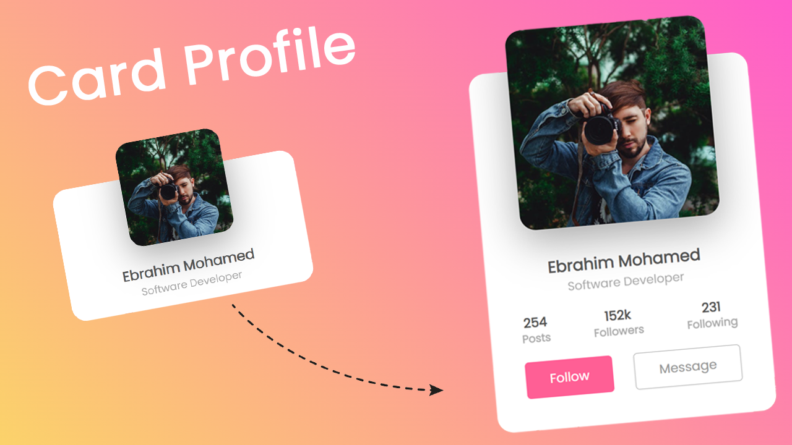

# Card-Profile
Card-Profile

## Source Code

HTML Code
```html
<!DOCTYPE html>
<html lang="en">
  <head>
    <meta charset="UTF-8" />
    <meta http-equiv="X-UA-Compatible" content="IE=edge" />
    <meta name="viewport" content="width=device-width, initial-scale=1.0" />
    <title>Profile Card</title>
    <link rel="stylesheet" href="css/style.css" />
  </head>
  <body>
    <div class="card">
      <div class="image-box">
        
        <!--  -->
        <!--  -->
      </div>
      <div class="content">
        <div class="details">
          <h2>Ebrahim Mohamed<br /><span>Software Developer</span></h2>
          <div class="data">
            <h3>254<br /><span>Posts</span></h3>
            <h3>152k<br /><span>Followers</span></h3>
            <h3>231<br /><span>Following</span></h3>
          </div>
          <div class="action-button">
            <button>Follow</button>
            <button>Message</button>
          </div>
        </div>
      </div>
    </div>
  </body>
</html>

```

CSS Code

```css
* {
  padding: 0;
  margin: 0;
  box-sizing: border-box;
  font-family: "Poppins";
}

body {
  display: flex;
  justify-content: center;
  align-items: center;
  min-height: 100vh;
  background: linear-gradient(45deg, #fbda64, #ff5acd);
}

.card {
  position: relative;
  width: 350px;
  height: 190px;
  /* height: 450px; */
  background-color: #fff;
  border-radius: 20px;
  box-shadow: 0 35px 80px rgba(0, 0, 0, 0.15);
  transition: 0.5s;
}
.card:hover {
  height: 450px;
}

.card:hover .image-box {
  width: 250px;
  height: 250px;
}
.image-box {
  position: absolute;
  width: 150px;
  height: 150px;
  border-radius: 20px;
  background-color: #fff;
  top: -50px;
  left: 50%;
  transform: translateX(-50%);
  box-shadow: 0 15px 50px rgba(0, 0, 0, 0.35);
  overflow: hidden;
  transition: 0.5s;
}

.image-box img {
  position: absolute;
  top: 0;
  left: 0;
  object-fit: cover;
  height: 100%;
  width: 100%;
}

.card .content {
  position: absolute;
  width: 100%;
  height: 100%;
  display: flex;
  justify-content: center;
  align-items: flex-end;
  overflow: hidden;
}

.card .content .details {
  text-align: center;
  width: 100%;
  padding: 40px;
  transition: 0.5s;
  transform: translateY(150px);
}
.card:hover .content .details {
  transform: translateY(0px);
}
.card .content .details h2 {
  font-size: 1.25em;
  font-weight: 600;
  color: #555;
  line-height: 1.2em;
}
.card .content h2 span {
  font-size: 0.75em;
  font-weight: 500;
  opacity: 0.5;
}

.card .content .details .data {
  display: flex;
  justify-content: space-between;
  margin: 20px 0;
}

.card .content .details .data h3 {
  font-size: 1em;
  color: #555;
  line-height: 1.2em;
  font-weight: 600;
}

.card .content .details .data h3 span {
  font-size: 0.85em;
  opacity: 0.5;
  line-height: 1.24006;
}

.card .content .details .action-button {
  display: flex;
  justify-content: space-between;
}

.card .content .details .action-button button {
  padding: 10px 30px;
  border-radius: 5px;
  border: none;
  outline: none;
  font-size: 1em;
  font-weight: 500;
  background: #ff5f95;
  color: #fff;
  cursor: pointer;
}

.card .content .details .action-button button:nth-child(2) {
  border: 1px solid #999;
  background: #fff;
  color: #999;
}

```